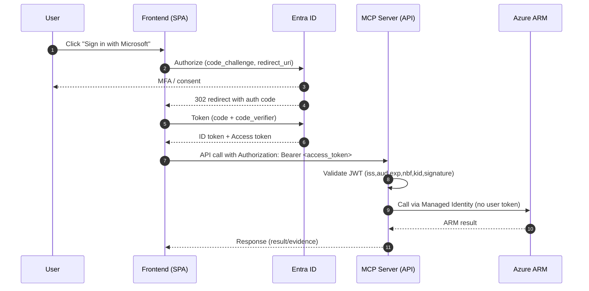

# AZ Servant — 15분 기획 발표 자료 (v0.3.x)

## 1) 왜 이걸 만드나 (Problem → Impact)
- 문제: 권한·정책·네트워크 제약을 배포 직전에 발견 → 반복 대기/실패/티켓 폭증, 운영·보안팀 부담 증가, 근거 추적 어려움
- 목표: 사전 판정(가능/불가/조건부 + 근거) → 승인 → 자동 적용까지 표준화하여 리드타임 단축·재작업 최소화
- 핵심 가설: “개발자가 지금 당장 ‘이 스코프에서 무엇이 가능한지’를 한 번에 보고, 가능한 건 승인이 나면 자동으로 실행”
- 기대효과:
  - 배포 실패율↓, 승인 처리속도↑, 표준 준수율↑(태그/리전/SKU/암호화), 운영티켓↓, DevEx↑

## 2) 무엇을 만드는가 (Scope)
- MCP 기반 에이전트: Plan(판정) → Confirm(승인) → Apply(실행) → Request(불가 시 신청)
- 서버(규칙/SDK/CLI) + 클라이언트(LangGraph, LLM 선택) 분리 — 서버는 LLM 미사용
- 대상 리소스(초기): AKS, ACR, Key Vault, Event Hubs, Storage, Redis, Managed Disks, VNet 등
- 사내 표준 스펙(리소스 템플릿/제약) 반영: `azs.spec(resourceType)`로 UI/에이전트가 정확한 파라미터를 요구

## 3) 아키텍처 개요 (Landing Zone + ZTNA + Entra ID)

아래는 사내 망 구조에 맞춘 구현 명세서 수준의 아키텍처입니다.

### 영역과 구성요소
- 신뢰 구역(Trust Zones)
  - 사용자 단말: ZTNA 클라이언트 필수, 사내 단말·정책 준수
  - 경계(Edge): App Gateway/WAF(프라이빗) + Private DNS
  - 애플리케이션: Controller(웹 UI + MCP Server/API), 내부 서브넷
  - 실행(Runner): 비동기 작업 러너(내부 서브넷, MI), 외부 인바운드 차단
  - 공용 제어면: Azure ARM/RBAC/Policy, Entra ID(토큰 발급), ServiceNow API

- 런타임 컴포넌트
  - Controller(내부):
    - Web UI(SPA) + API(FastAPI)
    - MCP HTTP 브리지(`/mcp/tools`) 및 표준 MCP(stdio/WS, 내부용)
  - Runner(내부):
    - 큐 기반 작업 소비자(Apply 실행자)
    - User-Assigned Managed Identity(Plan/Apply 분리 권장)
  - 메시징: Azure Service Bus(승인/작업 전달, 재시도/Idempotency)
  - 비밀/구성: Azure Key Vault(앱 설정, 서명 키, 외부 자격 연계 금지)
  - 로깅/모니터링: Azure Monitor + Log Analytics + Activity Log 링크화

### 네트워크/인그레스·이그레스
- 인그레스
  - App GW/WAF(프라이빗) → Controller(ILB)만 허용
  - 외부 인터넷 인바운드 없음, ZTNA 통과 단말만 접근
- 이그레스(최소 허용)
  - Entra ID(Login/Token): `login.microsoftonline.com`/`login.partner.microsoftonline.cn` 등 테넌트 엔드포인트
  - Azure ARM/Graph: `management.azure.com`, `graph.microsoft.com` (정책/역할 조회 시)
  - Key Vault: 비밀/구성 조회
  - Service Bus: 큐/토픽 송수신
  - Storage: 증빙 번들 저장(리소스 스냅샷/MD/JSON)
  - ServiceNow: 신청서 제출(허브 에이전트 경유 시 내부 연계로 대체 가능)
- 서브넷/NSG
  - `subnet-edge`(AGW), `subnet-app`(Controller), `subnet-runner`(Runner)
  - NSG/UDR로 이그레스 목적지 최소화(위 호스트만 허용)

### 아이덴티티/권한
- 사용자 인증(Entra OIDC, 리다이렉션)
  - App Registration: `azs-client`(SPA), `azs-server`(Web API)
  - `azs-server`는 API 스코프(예: `api://azs-server/access_as_user`)와 App Roles(azs.user/approver/admin) 노출
  - 브라우저 Authorization Code + PKCE로 로그인 → 프론트가 Access Token을 획득 → API 호출 시 `Authorization: Bearer`로 첨부
- 실행 주체(Managed Identity):
  - PlanMI: Reader(+ Microsoft.Authorization/*/read) — RBAC/Policy 읽기
  - ApplyMI: 최소 Custom Role — 리소스 타입별 write만 허용
  - 필요 시 구독/리소스그룹/타입 별로 MI 분리(권한 파티셔닝)
- 승인/러너 게이트
  - Controller는 Apply 요청을 Service Bus로 게시
  - Runner는 승인 토큰/정책 체크 후 실행, 결과와 Activity Log 링크 반환

### 거버넌스 기준
- Policy 베이스라인: 허용 리전(Allowed locations), 필수 태그(Require tag), deny 효과(거부 조건) 준수
- 태깅 표준: `Environment`, `Project`, `Owner`, `CostCenter`, `Compliance` 등 필수/기본값 적용
- 리소스 스펙 기준: 사내 표준을 `azs.spec(resourceType)`로 노출하여 파라미터 검증/가이드 일원화
- 승인/신청: 차단된 작업은 ServiceNow 신청 양식(JSON/MD) 생성(시스템은 승인자가 아님), 허브의 신청 에이전트 연동 시 자동 접수 가능

### API/프로토콜 명세(요약)
- 외부 노출(사내):
  - `GET /healthz`
  - `GET /me/*`, `GET /plan/*`, `POST/DELETE /apply/resource-group`
  - `GET|POST /mcp/tools` — MCP 툴 브리지(HTTP)
  - `GET /auth/status`, `POST /auth/login`(PoC용 수동 안내)
  - 모든 보호 엔드포인트는 `Authorization: Bearer <access_token>` 요구(사내 배포 시)
- 내부용:
  - MCP stdio/WebSocket 서버(개발/허브 연계)
  - Service Bus 큐/토픽(`apply-requests`, `apply-results` 등)

### 데이터/저장/증빙
- 세션 상태: Redis(채팅/작업 컨텍스트), TTL 관리, PII 최소화
- 증빙 번들: Storage 계정(리소스 ID, 태그, 정책 결과, 요약 MD/JSON)
- 비밀/키: Key Vault(MI로 접근), 앱 내부에 비밀 저장 금지
- 감사 로그: request_id, actor_oid, scope, decision(allowed|blocked|conditional), evidence_uri, activity_log_url

### 운영/배포 규칙
- 배포: AKS/ACA/App Service(ASEv3) 내부형 중 택1 — 모든 인바운드는 App GW/WAF만
- 스케일: Controller(HPA/수평 확장), Runner(큐 기반 오토스케일)
- 백업/DR: 증빙 Storage ZRS, 로그 보존 정책, 구성 IaC(Terraform/Bicep)로 재현성 확보
- DBsafer: 대화형 SSH/쿠버 접점은 DBsafer 경유(감사), 자동화 경로와 명확히 분리

## 4) 보안 · 인증 · 거버넌스
- 사용자 인증(OIDC):
  - 패턴 A(권장): 프론트에서 MSAL.js(Authorization Code + PKCE)로 로그인 → 브라우저가 Access Token을 받고 서버 호출 시 `Authorization: Bearer <token>` 첨부
  - 패턴 B(대안): 플랫폼 내장 인증(Container Apps/App Service Easy Auth) 사용 → 플랫폼이 세션/헤더(`X-MS-CLIENT-PRINCIPAL`)로 사용자 주체 전달
  - 서버는 JWT를 검증(iss/aud/exp/nbf/kid/서명)하고 `oid/roles`로 사용자 식별·인가 수행
  - 서버 내부 RBAC: azs.user/approver/admin App Role 매핑
- 실행 주체(MI):
  - Plan용 MI: Reader(+ Microsoft.Authorization/*/read)
  - Apply용 MI: 최소 Custom Role(리소스별 write 한정), 승인 토큰·내부 러너 게이트
- ZTNA: 사내 포털 접속·서비스 접근 전제. UI/Controller/Runner 모두 프라이빗. 외부 노출 없음.
- DBsafer(배스천) 연동:
  - 대화형 SSH/쿠버 접근은 기존 DBsafer 경로(감사·명령기록 유지)
  - Runner는 VNet 내부 MI로 동작하므로 `az login` 불필요. Break-glass 상황에만 DBsafer로 접속
- 옵션: OBO(On-Behalf-Of) — Plan을 ‘사용자 토큰’ 콘텍스트로 ARM에 위임(필요 시). 기본은 MI 권장.

### 데이터/토큰 흐름
- 로그인: 브라우저 OIDC → JWT → 서버 검증 → 세션은 별도(채팅 상태; Redis 추천)
- Plan: 서버(MI)가 RBAC/Policy 조회 → 결과에 사용자 `oid` 기준 판정 포함 → LLM(선택) 요약
- Confirm: 승인 토큰 생성(실) 또는 수동 컨펌(PoC) → 큐 게시
- Apply: Runner(MI)가 작업 수행 → 결과/증빙 번들 생성(리소스 ID, Activity Log 링크, 태그, JSON/MD)
- Request: 불가 항목은 “ServiceNow 신청 양식(JSON/Markdown)”을 자동 생성(이 시스템은 ‘승인 기관’이 아님)
  - 허브에 ServiceNow 신청 에이전트가 있으면 해당 에이전트로 전송하여 실제 신청까지 자동화 가능
  - 사용자 부재 권한/정책/네트워크 근거를 포함해 심사 효율을 높임

### 인증 시퀀스(Authorization Code + PKCE)
```
사용자            프론트(SPA)                 Entra ID                      MCP 서버(API)                  Azure(ARM)
 |  "Microsoft 로그인" 클릭  |                       |                                |                               |
 | -------------------------> |  /authorize 리다이렉트 |                                |                               |
 |                            | ----------------------> |  MFA/인증                      |                               |
 |                            | <---------------------- |  코드와 함께 리다이렉트        |                               |
 |                            |  /token 교환(code+verifier)                             |                               |
 |                            | ----------------------> |  ID/Access Token 발급          |                               |
 |                            |  (브라우저 메모리/세션스토리지 보관)                     |                               |
 |  API 호출                  |  Authorization: Bearer <access_token>                    |                               |
 | -------------------------> | --------------------------------------------------------> |  JWT 검증(iss/aud/exp/kid)     |
 |                            |                                                            |  oid/roles 추출·인가           |
 |                            |                                                            |  (Plan/Apply 판단)             |
 |                            |                                                            |  (필요 시 큐에 작업 게시)       |
 |                            |                                                            | --- MI로 ARM 토큰 획득 ------> |
 |                            |                                                            | <----------- ARM 응답 --------- |
 |                            | <------------------------------- 결과/요약 ----------------|                               |
```
설명
- 프론트는 Entra ID에서 API용 Access Token을 받아 요청마다 `Authorization: Bearer`로 첨부합니다.
- 서버는 토큰을 검증해 사용자(oid/roles)를 식별·인가하고, 실제 Azure 호출은 Managed Identity로 수행합니다.
- 필요 시 On-Behalf-Of(OBO)로 ‘사용자 권한으로 읽기’만 위임할 수 있으나, 기본은 MI 권장입니다.

#### Mermaid 시퀀스 다이어그램 예시


## 5) 현재 구현 현황(요약)
- 서버 FastAPI: `/me/*`, `/plan/*`, `/apply/resource-group`, `/mcp/tools`, `/auth/*`
- MCP 툴: `azs.plan`, `azs.apply`, `azs.request`, `azs.spec` + 목록/조회 헬퍼
- 클라이언트: LangGraph + 웹 UI(드롭다운/확인 UI/로그인 안내)
- 참고 파일: `ARCHITECTURE.md`, `PROJECT_OVERVIEW.md`, `mcpserver/app.py`, `mcpserver/mcp_tools.py`

## 6) 상용 배포 설계(안)
- 배치
  - Controller: AKS/ACA/App Service(ASEv3) 내부형, App GW/WAF 프라이빗, Private DNS
  - Runner: 내부 서브넷, 스케일 아웃 가능한 풀, MI 부여
  - 메시징: Service Bus(표준), 지연 내성/재시도/Idempotency
- 비밀/설정: Key Vault, System/UA Managed Identity
- 관측: Azure Monitor + Log Analytics, 표준 로그 스키마(request_id, actor_oid, scope, action, decision)
- 백업/가용성: ZRS 저장소(증빙/로그), 다중 AZ 고려

## 7) DBsafer/접근 정책 시나리오
- “Dev 구독 리소스는 로컬에서 못 붙는다” 정책 유지
- 운영 경로 분리:
  - 비대화형 배포/관리: MCP Runner(MI)로 자동화(감사용 로그), DBsafer 불필요
  - 대화형/장비접속: DBsafer → VM/쿠버 경로 유지(명령기록·감사 연동)
- 장점: 운영 접점 명확화(자율 자동화 vs. 통제된 수동접속)

## 8) 거버넌스/표준 연동
- 사내 표준 스펙 카탈로그화 → `azs.spec` 제공(필수/옵션/패턴/정책 힌트)
- 정책 동기화: Azure Policy + 사내용 규칙(태그, 네트워크, 스토리지 암호화) 주기 싱크
- 태깅 표준: `Environment`, `Project`, `Owner`, `CostCenter`, `Compliance` 등 강제/기본값 적용

## 9) 승인·감사·증빙
- 승인: ServiceNow는 ‘승인 시스템’이 아니라 ‘신청 포털’로 사용(권한/리소스 요청 접수)
  - 이 시스템은 승인 자체를 수행하지 않음. 차단된 작업은 신청 양식 생성 → (선택) ServiceNow 에이전트로 자동 제출
- 감사: Actor(oid), Request, Plan 결과, Apply 상세, Activity Log 링크, 결과 스냅샷 번들
- 증빙 저장: Storage(증빙 번들), Key Vault(민감정보), 보존 주기 정책

## 10) 보안 통제 포인트
- 외부 인바운드 금지, ZTNA 필수, TLS, mTLS(내부), IP 규칙/NSG/UDR 최소화
- OIDC 토큰 검증(iss/aud/nbf/exp/nonce)
- 서버 RBAC(App Roles), 요청 스코프 검증, 행위 권한 테이블(필요 액션 매핑)
- MI 최소 권한(Plan/Apply 분리), 비밀 없는 실행
- SAST/DAST 및 릴리스 게이트(보안·준법 체크리스트)

## 11) 운영 모델
- 팀 RACI
  - Product: 요구/우선순위/승인 정책 정의
  - Platform: 인프라/배포/관측/비용
  - Security: ZTNA/Entra/Key Vault/승인/감사
  - App: MCP 툴/정책 파서/스펙 카탈로그/에이전트 UX
- 장애 대응: 알람(지표/로그) → 온콜 → 롤백/격리 → 사후 분석(증빙 번들)

<!-- 로드맵 섹션은 요청에 따라 제거되었습니다. -->

## 12) 성공 지표(KPI)
- 배포 리드타임: Triage→승인→적용까지 P50/P90
- 첫 시도 성공률(권한/정책 위반 없이 통과)
- 재작업/티켓 수 감소, 승인 대기 평균↓
- 표준 태깅/암호화/리전 준수율

## 13) 리스크 & 대응
- 정책 해석 불완전성 → 대표 패턴부터 커버, 위반 시 명확한 수정 힌트 제공
- OBO 복잡성/CA정책 영향 → 기본 MI, OBO는 선택 적용
- CLI 의존 → SDK 전환 계획 수립, 장애/성능 모니터링, 재시도/서킷브레이커
- 승인 우회 위험 → 승인 토큰·내부 러너 게이트·감사 로그 강제

## 14) 비용 러프 견적(월)
- App(Controller): App Service/ACA 중형 x N
- Runner: VMSS 또는 컨테이너 x N(미터링 기준 자동스케일)
- Service Bus S1, Log Analytics(GB/일), Key Vault, Storage(증빙)
- Private DNS/AGW WAF/Private Link 등 LZ 표준 비용

## 15) 데모 시나리오(15분 내)
- 기본: 구독 선택 → Plan(capabilities/constraints) → Confirm → Apply → 결과/증빙 → Blocked 사례에서 ServiceNow 신청 양식 생성(포털 제출 X)
- 확장: Terraform/Markdown 스펙 업로드 → 파싱 → 리소스별 Plan/권한·정책 점검 → 일부 Apply, 일부는 신청 양식 생성
- 허브: ServiceNow 신청 에이전트로 자동 전달(있을 경우), Confluence MCP에 결과 요약 게시(선택)
- IDE(MCP)·웹 UI·DBsafer 경로 구분 설명(자동화 vs. 수동접속)

---

### 부록 A. 용어
- ZTNA: 사내단말·정책 기반 내부 접근 게이트웨이
- Entra ID(OIDC): 사용자 인증·토큰 발급
- MI: Azure Managed Identity(서버/러너 실행 권한)
- OBO: On-Behalf-Of 토큰 교환(선택)
- MCP: Model Context Protocol(툴 캡슐화/오케스트레이션)

### 부록 B. 설계 원칙
- 실행 주체 분리(사용자 vs. 시스템), 최소 권한, 승인·감사 우선
- 내부 우선(프라이빗), 표준 템플릿/정책 일치, “최소 변경·명확 근거”

### 부록 C. MCP 허브·비챗 입력(최종 구상)
- MCP 허브 연동(다중 에이전트)
  - Azure Servant는 MCP 툴 제공자 역할; 허브에서 ServiceNow 신청 에이전트, Confluence MCP 등과 상호 호출
  - 차단 작업 → 신청 양식 생성 → ServiceNow 에이전트로 전달(자동 접수) → 결과/상태는 허브를 통해 조회
- 비챗 입력(스펙 기반)
  - Terraform/Markdown 스펙을 단번에 업로드 → 파서가 리소스 목록/파라미터 추출 → 리소스별 Plan/점검 → Confirm 후 Apply/Request 분기
  - 대량/표준화된 요청에 적합, 에이전트는 오류·위반 항목에 대해 구체 근거와 수정 힌트 제시
